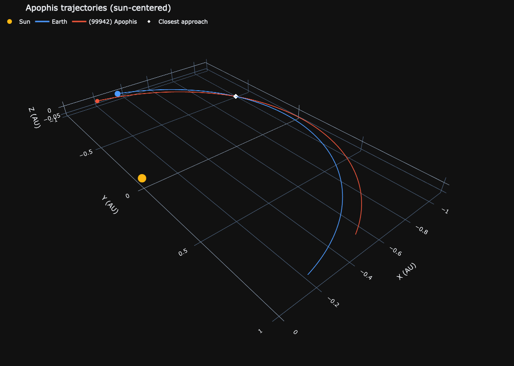
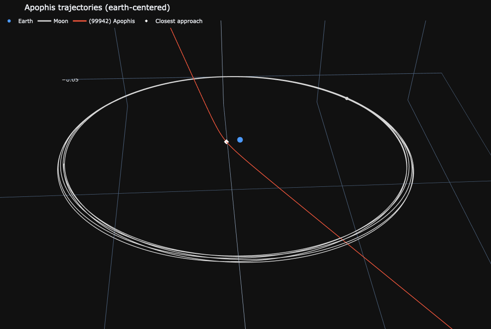

# Apophis Simulation: Numerical Study of the 2029 Earth Close Encounter

<table align="center">
  <tr>
    <td align="center">
      
    </td>
    <td align="center">
      
    </td>
  </tr>
</table>

`apophis-sim` is a research-oriented Python package for studying the 2029 close encounter of asteroid **(99942) Apophis**. It combines N-body propagation, orbital-element analysis, two-body utilities, patched-conics diagnostics, and interactive 3D visualizations.

The project is designed for teaching, exploratory research, reproducible computational work, and an academic software portfolio. It is not an operational orbit-determination tool; use official ephemerides for authoritative predictions.

## Scientific motivation

Apophis will pass unusually close to Earth on 13 April 2029. Earth's gravitational perturbation materially changes its heliocentric orbit, making the event an instructive example of close encounters, osculating orbital elements, and the limits of two-body approximations.

## Features

- N-body integration with REBOUND's adaptive IAS15 integrator.
- Initial conditions retrieved from JPL Horizons through REBOUND.
- Closest-approach detection and pre-/post-encounter orbital elements.
- Kepler-equation and patched-conics utilities for analytical studies.
- Interactive Plotly 3D figures in Sun- and Earth-centered frames.
- Optional Moon trajectory and an interactive terminal example.

See [docs/methods.md](docs/methods.md) for assumptions and limitations.

## Installation

```bash
git clone https://github.com/jmanuelagudelo/apophis-simulation.git
cd apophis-simulation

python3.12 -m venv .venv
source .venv/bin/activate

python -m pip install --upgrade pip
python -m pip install -e '.[rebound,dev]'
```

### Python and REBOUND compatibility

The project is developed and tested with **Python 3.12**. REBOUND includes a compiled C library, so it can lag behind the newest Python releases. On macOS, this package pins REBOUND to the 5.0 release series because REBOUND 5.1 introduced a WHFast512 implementation that does not support macOS.

Confirm the installation before running a simulation:

```bash
python -c "import rebound; print(rebound.__version__)"
```

If the command reports a `symbol not found` error, recreate `.venv` with Python 3.12 and reinstall from the commands above. JPL Horizons lookups also require an active internet connection.

## Quick start

```python
from datetime import datetime

from apophis_sim import ApophisSimulation

sim = ApophisSimulation(
    start_date=datetime(2029, 1, 1),
    end_date=datetime(2029, 6, 1),
    steps=20_000,
).run()

print(sim.closest_approach())

sim.plot(
    center="sun",
    bodies=["sun", "earth", "apophis"],
    trails=True,
    equal_axes=True,
    theme="dark",
).show()
```

Use `sim.plot(center="earth", zoom="close", show_moon=True)` for a close-encounter view. In this view Earth is at the origin and the Sun is intentionally omitted: it is about 1 AU away, far outside the +/- 0.03 AU encounter scale. Use `center="earth"` without `zoom="close"` to show the physically translated Sun.

## Interactive close-approach example

The packaged example prompts for a reference frame, zoom setting, and the bodies to display before integrating the system:

```bash
python examples/close_approach.py
```

Typical interaction:

```text
Reference center: Earth or Sun [earth]:
Use the close-encounter zoom [Y/n]:
Graph the Sun [y/N]:
Graph Earth [Y/n]:
Graph the Moon [y/N]:
Graph Apophis [Y/n]:
```

Choose `earth` and accept the close zoom for the clearest view of the Earth-Apophis encounter. If you choose the Sun, the example automatically disables the close zoom so that the physical Sun position remains visible. The simulation then prints the sampled closest-approach epoch and distance and opens a Plotly figure in the browser.

## API overview

| API | Purpose |
| --- | --- |
| `ApophisSimulation.run()` | Propagate the configured N-body model. |
| `closest_approach()` | Return the sampled closest Earth-Apophis separation. |
| `compute_orbital_elements()` | Return initial and final osculating elements. |
| `compare_methods()` | Return the available method-comparison summary. |
| `plot()` / `animate()` | Create interactive Plotly visualizations. |
| `patched_conics` | Kepler and Earth-relative hyperbolic-encounter utilities. |

For example, retrieve orbital elements with:

```python
initial_elements, final_elements = sim.compute_orbital_elements()
print(initial_elements)
print(final_elements)
```

## Project structure

```text
apophis-simulation/
├── src/apophis_sim/
│   ├── simulation.py
│   ├── visualization.py
│   ├── orbital_elements.py
│   ├── patched_conics.py
│   ├── bodies.py
│   ├── constants.py
│   └── utils.py
├── examples/
├── tests/
├── docs/
├── README.md
└── pyproject.toml
```

## Future work

- Refine the sampled closest approach with event localization.
- Compare results against archived JPL close-approach records.
- Add covariance propagation and uncertainty analysis.
- Add observation-frame coordinates and reproducible cached ephemerides.
- Extend the method comparison with a full two-body propagation workflow.

## Citation and acknowledgements

If you use this software in academic work, cite this repository:

```bibtex
@software{agudelo2026apophis_sim,
  author = {Agudelo, J. Manuel},
  title = {Apophis Simulation: Numerical Study of the 2029 Close Encounter},
  year = {2026},
  url = {https://github.com/jmanuelagudelo/apophis-simulation}
}
```

The original study and the package dependencies acknowledge `pymcel`. Cite it when using or building upon its celestial-mechanics utilities:

```bibtex
@software{zuluaga2026pymcel,
  author = {Zuluaga, Jorge I.},
  title = {pymcel: Utilidades de Mecánica Celeste y Astrodinámica},
  year = {2026},
  doi = {10.5281/zenodo.18849743},
  url = {https://doi.org/10.5281/zenodo.18849743}
}
```

The N-body results use REBOUND. Its documentation recommends obtaining the citations appropriate to a configuration with `sim.cite()`; the base software citation is:

```bibtex
@article{rein2012rebound,
  author = {Rein, Hanno and Liu, Shang-Fei},
  title = {REBOUND: an open-source multi-purpose N-body code for collisional dynamics},
  journal = {Astronomy and Astrophysics},
  volume = {537},
  pages = {A128},
  year = {2012},
  doi = {10.1051/0004-6361/201118085}
}
```

Initial states are retrieved through the [NASA JPL Horizons system](https://ssd.jpl.nasa.gov/horizons/); cite the relevant Horizons dataset or service when publishing derived results.

## License

MIT. See [LICENSE](LICENSE).
